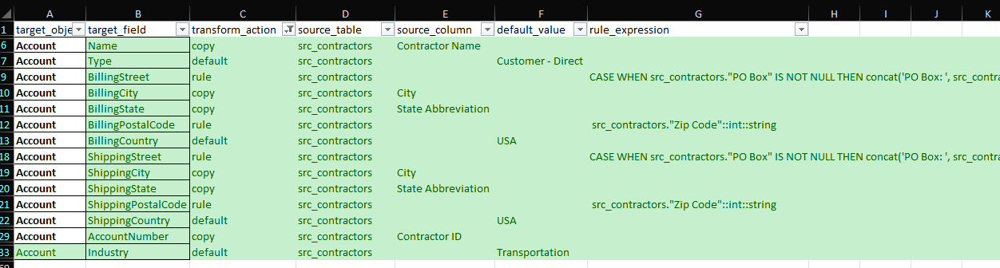

# Proof of Concept Framework for Data Migration into Salesforce.com

## Objective

I think I've been passed over by several recruiters for Salesforce.com data migration gigs with the excuse that I can't demonstrate specific skills of loading data into Salseforce.com. My arguments that I 'was exposed' to SFDC on several previous projects, that I worked with many other CRMs and that these conversations are like "asking an experienced carpenter if he can build an orange house" seem to fall in deaf ears. I guess everybody says that. OK, so here is me show-and-telling: I know how to migrate data into Salesforce.com.

##  Source Data

I am getting a public dataset of real company addresses from the government. For free (paid by my taxes, but never mind).

Open [Mine Data Retrieval System](https://www.msha.gov/data-and-reports/mine-data-retrieval-system) from  [Mine Safety and Health Administration](https://www.msha.gov/) of the U.S. Department of Labor.

Extended Search> Advanced Search - Mines> Unselect all Filters > Run Document

Export to Excel: Mine, Current Operator, Mine Address


Extended Search> Advanced Search -Contractors> Unselect all Filters > Run Document. Export to Excel.

 

I saved all downloaded source files into the `data` folder: [src_mine_information.xlsx](data/src_mine_information.xlsx), [src_addresses_of_record.xlsx](data/src_addresses_of_record.xlsx), [src_operator_report.xlsx](data/src_operator_report.xlsx), and [src_contractors.xlsx](data/src_contractors.xlsx). We'd work with `src_contractors.xlsx` for now. I'll save the rest for the future exercises.


## Infrastructure

The project is build around the Python command line (CLI) application that manipulates that data in the [DuckDB](https://duckdb.org/docs/) database. I use Python module [simple-salesforce](https://pypi.org/project/simple-salesforce/) to read data from and load into Salesforce.com. While off the shelf tools like [Data Loader](https://developer.salesforce.com/docs/atlas.en-us.dataLoader.meta/dataLoader/data_loader_intro.htm) and Import Wizards exist, i think this way is much better to integrate into the overall flow and methodology and to automate many manual steps. Application saves reports into Excel files.

### Environment setup 

I developed this project locally on my Windows 11 laptop. I kept the code OS agnostic. If you want to run it locally install Python (I recommend [Anaconda](https://www.anaconda.com/download/success) distribution), Visual Studio Code](https://code.visualstudio.com/download) and [git](https://git-scm.com/downloads). Then clone this repo and change dir to the project folder.

Alternatively, you can run this code on GitHub [codespaces](https://github.com/codespaces): fork this repository to your GitHub account. Click on **Code** and then **Create codespace on main**.

 

We are using several Python modules that need to be installed so locally or on codespaces run this command in your terminal.

```bash
pip install -r requirements.txt
```


## Data Migration Methodology via Steps to Reproduce This Project

### Target and Source System Discovery  and Establishing Connectivity

#### Getting Salesforce.com developer account

[Sign up for your Salesforce Developer Edition](https://developer.salesforce.com/signup). Save your user name and password.

#### Saleseforce.com Authentication

Getting authentication to work with simple_salesforce in Python was a biggest hurdle for me in this project. We already have username and password that we saved when we got the developer account. Now the third part:`security_token`.

You can get it in Salesforce.com, using `Lightning` Theme:

Click in the top right corner your `profile icon` -> `Settings`


In the tree select `My Personal Information` -> `Reset My Security Token`

Click `Reset Security Token`


Check your email for a new token.

####  Secret Management

In VS Code create `.env` file in the project directory.


Paste following lines into it:

```bash
SFDC_USERNAME="REPLACE_SFDC_USERNAME"
SFDC_PASSWORD="REPLACE_SFDC_PASSWORD"
SFDC_SECURITY_TOKEN="REPLACE_SFDC_SECURITY_TOKEN"
```

Paste your authentication values instead of placeholders.

### Source Tables Snapshot

We copy all source data into our database so it would be easier to query, profile, map and stage. As downloaded source files have a couple of blank lines above headers so had to use pandas to read them instead of native duckdb.

If we'd have some other sources based on databases we could use more advanced load tools like [dlt](https://dlthub.com/), [Sling](https://docs.slingdata.io/) or [Airbyte](https://docs.airbyte.com/deploying-airbyte/local-deployment).

```bash
python migrate2sfdc.py  --action get_src
```

`Data Migration into Salesforce.com`

`Refreshing Source Tables Snapshot`

`Read 89900 records from data\src_addresses_of_record.xlsx`

`Read 87098 records from data\src_contractors.xlsx`

`Read 90587 records from data\src_mine_information.xlsx`

`Read 90196 records from data\src_operator_report.xlsx`


### Target Tables Snapshot

We read all records for selected objects from salesforce.com with the help of simple_salesforce using some generated [SOQL](https://developer.salesforce.com/blogs/2021/09/how-to-automate-data-extraction-from-salesforce-using-python). We save results into database tables and into Excel files that we can give to our project stakeholders as target reports. 

```bash
python migrate2sfdc.py  --action get_tgt
```

`Data Migration into Salesforce.com`

`Refreshing Target Tables Snapshot`

`Dowloaded 2340 records for Account` 

 `saved into table tgt_account` 

 `saved into file data\tgt_account.xlsx` 

`Dowloaded 0 records for Address` 

`Dowloaded 20 records for Contact` 

 `saved into table tgt_contact` 

 `saved into file data\tgt_contact.xlsx` 


### Data Profiling

We can get some table summaries with the command below. For detailed analysis I usually use some SQL query tool like [Dbeaver](https://duckdb.org/docs/guides/sql_editors/dbeaver.html).

```bash
python migrate2sfdc.py  --action profile --src_table src_contractors
```

`Data Migration into Salesforce.com`

`Profiling table {src_table}`

`SUMMARIZE src_contractors`

| column_name        | column_type   | min                     | max             |   approx_unique |   count | null_percentage   |
|:-------------------|:--------------|:------------------------|:----------------|----------------:|--------:|:------------------|
| Contractor ID      | VARCHAR       | 073                     | ZZZ             |           87368 |   87098 | 0.0%              |
| Contractor Name    | VARCHAR       | Beeson Welding          | zap enterprises |           84320 |   87098 | 0.0%              |
| PO Box             | VARCHAR       | 10                      | Z               |            6517 |   87098 | 69.14%            |
| Postal             | VARCHAR       | 08788                   | p0m1b0          |             167 |   87098 | 99.8%             |
| City               | VARCHAR       | Albuquerque             | zephyrhills     |           15373 |   87098 | 0.0%              |
| Street             | VARCHAR       | 5129 GILBERTSVILLE HWY. | w7022 hwy 11    |           57355 |   87098 | 31.21%            |
| State Abbreviation | VARCHAR       | AK                      | WY              |              57 |   87098 | 0.21%             |
| Zip Code           | DOUBLE        | 0.0                     | 998019115.0     |           20900 |   87098 | 0.22%             |

### Column Mapping

We enter column mapping into [mapping.xlsx](data/mapping.xlsx). We get target column list from the tgt reports above. Just paste special / transpose them into `target_field` column.  Enter mapping information in the format provided in the included sample file.



When finished, save the mapping file and run the below command to upload the mapping into the database:

```bash
python migrate2sfdc.py --action get_map
```

`Data Migration into Salesforce.com`

`Refreshing mapping table`

`Loaded 67 records from data\mapping.xlsx`

### Create or Refresh Staging Table

The following command creates the staging table modelled by the mapping. Columns get populated with the rules defined in the mapping. 

As demo for data filtering we mark already loaded records and flag records with duplicate company Name.

Again if more elaborate transformation would be required we can generate SQL models for tools like [DBT](https://docs.getdbt.com/docs/core/about-core-setup) or [SQLMesh](https://sqlmesh.com/).

```bash
python migrate2sfdc.py --action stage --obj_name Account --key_column AccountNumber --src_table src_contractors
```

`Data Migration into Salesforce.com`

`Creating or Refreshing Staging Table`

`Staging table stg_account is refreshed`

### Produce Pre-Load report

We generate preload reports as simple views on the staging tables. They contain all data in the target format that would be loaded. We output them into Excel files to be handed over to the stakeholders approval. Sample reports are included in the `data` folder.

```bash
python migrate2sfdc.py  --action pre_load_create --obj_name Account
```

`Data Migration into Salesforce.com`

`Creating Pre-load Reports for Account`

`Defined report preload_account`

```bash
python migrate2sfdc.py  --action pre_load_run
```

`Data Migration into Salesforce.com`

`Running Pre-load Reports`

`Created report data\preload_account.xlsx. 87098 records.`

### Load into Target System

We load eligible records into salesforce.com with the help of simple_salesforce. Loaded records get updated with their salesforce unique id. Failed records are updated with the error message from the simple_salesforce. 

```bash
python migrate2sfdc.py  --action load --obj_name Account --key_column AccountNumber --src_table src_contractors --batch_size 50
```


### Produce Post-Load Report

NOTE: Remember to repeat `Target Tables Snapshot` step before performing this step.

Post-Load reports are generated for column by column comparison to validate that all data is loaded as it was staged. Sample reports are included in the `data` folder. 

```bash
python migrate2sfdc.py  --action post_load_create --obj_name Account
```

`Data Migration into Salesforce.com`

`Creating Post-load Reports for Account`

`Defined report postload_account`

```bash
python migrate2sfdc.py  --action get_tgt
python migrate2sfdc.py  --action post_load_run
```

`Data Migration into Salesforce.com`

`Running Post-load Reports`

`Created report data\postload_account.xlsx. 87098 records.`


## Summary

Salesforce.com is a very developer friendly platform. Great documentation. One of the best working and well documented python API wrappers that I worked with.

Must be noted however, that default storage limits for sandbox environments are not conducive to comprehensive data load testing. This poses a significant risk to the success of data migration projects, as it’s crucial to load all data, ideally through multiple load-test-fix cycles. Without this, we leave ourselves exposed to the potential discovery of dormant and likely breaking data edge cases that remain unaddressed.

Possible workarounds could be testing in batches and mass-deleting after every batch or loading batches into separate sandboxes. 


And here we go! I have a working MVP. I hope you like it. If you do, maybe a star for the project would be nice 😀.

If you have any questions about the project, face any problems while following along, have a suggestion for me, or want to give me a gig feel free drop me a DM on  [Linkedin](https://www.linkedin.com/in/kurochka/).
