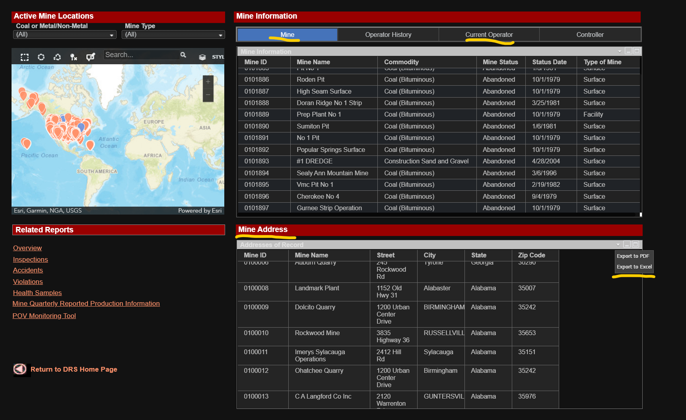

# Proof of Concept Framework for Data Migration into Salesforce.com

## Objective

I think I've been passed over by several recruiters for Salesforce.com data migration gigs with the excuse that I can't demonstrate specific skills of loading data into Salseforce.com. My arguments that I 'was exposed' to SFDC on several previous projects, that I worked with many other CRMs and that these conversations are like "asking an experienced carpenter if he can build an orange house" seem to fall in deaf ears. I guess everybody says that. OK, so here is me show-and-telling: I know how to migrate data into Salesforce.com.

##  Source Data

I am getting a public dataset of real company addresses from the government. For free (paid by my taxes, but never mind).

Open [Mine Data Retrieval System](https://www.msha.gov/data-and-reports/mine-data-retrieval-system) from  [Mine Safety and Health Administration](https://www.msha.gov/) of the U.S. Department of Labor.

Extended Search> Advanced Search - Mines> Unselect all Filters > Run Document

Export to Excel: Mine, Current Operator, Mine Address



Extended Search> Advanced Search -Contractors> Unselect all Filters > Run Document. Export to Excel.

 

I saved all downloaded source files into the `data` folder: [src_mine_information.xlsx](data/src_mine_information.xlsx), [src_addresses_of_record.xlsx](data/src_addresses_of_record.xlsx), [src_operator_report.xlsx](data/src_operator_report.xlsx), and [src_contractors.xlsx](data/src_contractors.xlsx). We'd work with `src_contractors.xlsx` for now. I'll save the rest for the future exercises.


## Infrastructure

### Environment setup 

I developed this project locally on my Windows 11 laptop. I kept the code OS agnostic. If you want to run it locally install Python (I recommend [Anaconda](https://www.anaconda.com/download/success) distribution), Visual Studio Code](https://code.visualstudio.com/download) and [git](https://git-scm.com/downloads). Then clone this repo and change dir to the project folder.

Alternatively, you can run this code on GitHub [codespaces](https://github.com/codespaces): fork this repository to your GitHub account. Click on **Code** and then **Create codespace on main**.

 

We are using several Python modules that need to be installed: [duckdb](https://duckdb.org/docs/guides/python/install.html), [Simple Salesforce](https://pypi.org/project/simple-salesforce/) 

### TODO

```bash
pip install
```


## Data Migration Methodology via Steps to Reproduce This Project

### Target and Source System Discovery  and Establishing Connectivity

#### Getting Salesforce.com developer account

[Sign up for your Salesforce Developer Edition](https://developer.salesforce.com/signup). Save your user name and password.

#### Saleseforce.com Authentication

Getting authentication to work with simple_salesforce in Python was a biggest hurdle for me in this project. We already have username and password that we saved when we got the developer account. Now the third part:`security_token`.

You can get it in Salesforce.com, using `Lightning` Theme:

Click in the top right corner your `profile icon` -> `Settings`


In the tree select `My Personal Information` -> `Reset My Security Token`

Click `Reset Security Token`


Check your email for a new token.

####  Secret Management

In VS Code create `.env` file in the project directory.


Paste following lines into it:

```bash
SFDC_USERNAME="REPLACE_SFDC_USERNAME"
SFDC_PASSWORD="REPLACE_SFDC_PASSWORD"
SFDC_SECURITY_TOKEN="REPLACE_SFDC_SECURITY_TOKEN"
```

Paste your authentication values instead of placeholders.

### Source Tables Snapshot

```bash
python migrate2sfdc.py  --action get_src
```

```
Data Migration into Salesforce.com
Refreshing Source Tables Snapshot
Read 89900 records from data\src_addresses_of_record.xlsx
Read 87098 records from data\src_contractors.xlsx
Read 90587 records from data\src_mine_information.xlsx
Read 90196 records from data\src_operator_report.xlsx
```


### Target Tables Snapshot

```bash
python migrate2sfdc.py  --action get_tgt
```

```
Data Migration into Salesforce.com
Refreshing Target Tables Snapshot
Dowloaded 2340 records for Account 
 saved into table tgt_account 
 saved into file data\tgt_account.xlsx 
Dowloaded 0 records for Address 
Dowloaded 20 records for Contact 
 saved into table tgt_contact 
 saved into file data\tgt_contact.xlsx 
```


### Data Profiling

```bash
python migrate2sfdc.py  --action profile --src_table src_contractors
```

```
Data Migration into Salesforce.com
Profiling table {src_table}
SUMMARIZE src_contractors
| column_name        | column_type   | min                     | max             |   approx_unique |   count | null_percentage   |
|:-------------------|:--------------|:------------------------|:----------------|----------------:|--------:|:------------------|
| Contractor ID      | VARCHAR       | 073                     | ZZZ             |           87368 |   87098 | 0.0%              |
| Contractor Name    | VARCHAR       | Beeson Welding          | zap enterprises |           84320 |   87098 | 0.0%              |
| PO Box             | VARCHAR       | 10                      | Z               |            6517 |   87098 | 69.14%            |
| Postal             | VARCHAR       | 08788                   | p0m1b0          |             167 |   87098 | 99.8%             |
| City               | VARCHAR       | Albuquerque             | zephyrhills     |           15373 |   87098 | 0.0%              |
| Street             | VARCHAR       | 5129 GILBERTSVILLE HWY. | w7022 hwy 11    |           57355 |   87098 | 31.21%            |
| State Abbreviation | VARCHAR       | AK                      | WY              |              57 |   87098 | 0.21%             |
| Zip Code           | DOUBLE        | 0.0                     | 998019115.0     |           20900 |   87098 | 0.22%             |
```

### Column Mapping

### 

```bash
python migrate2sfdc.py  --action get_map
```

```
Data Migration into Salesforce.com
Refreshing maping table
Loaded 67 records from data\mapping.xlsx
```

### Create or Refresh Staging Table

```bash
python migrate2sfdc.py  --action stage --obj_name Account --key_column AccountNumber --src_table src_contractors
```

```
Data Migration into Salesforce.com
Creating or Refreshing Staging Table
Staging table stg_account is refreshed
```

### 

### Produce Pre-Load report

```bash
python migrate2sfdc.py  --action pre_load_create
```

```
Creating Pre-load Reports
Defined report preload_account
```

```bash
python migrate2sfdc.py  --action pre_load_run
```

```
Data Migration into Salesforce.com
Running Pre-load Reports
Created report data\preload_account.xlsx. 87098 records.
```

### 

### Load into Target System

```bash
python migrate2sfdc.py  --action load --obj_name Account --key_column AccountNumber --src_table src_contractors --batch_size 50
```


### Produce Post-Load Report


## Summary

Salesforce.com is very developer friendly platform. Great documentation. One of the best working and well documented python API wrappers that I worked with.

Must be noted however, that default storage limits for sandbox environments do not land themselves to full data load tastings. This jeopardizes one of the biggest factors contributing to a successful data migration project - we need to load all data and preferably over several load-test-fix cycles. Otherwise the risk of discovery of the sleeper and potentially breaking data edge cases would be left unmitigated.

Potential workarounds could be testing in batches and mass-deleting after every batch or loading batches into separate sandboxes. 


